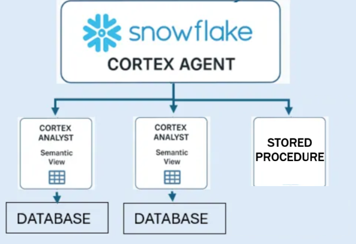

# Cortex Agents Tutorial: Health Insurance Claims

This tutorial walks through building a natural-language analytics workflow on the `GENERAL_DB.PUBLIC.CLAIMS` table using three Snowflake features:

1. **Semantic View** -- a SQL-defined object that teaches Cortex Analyst about your data
2. **Cortex Agent** -- an orchestrator that uses the semantic view (via Cortex Analyst) as a tool
3. **Snowflake CoWork** -- the chat UI where business users ask questions in plain English

The Agent can have several tools, we will also be adding a *stored procedure* as an additional tool.



---

## Prerequisites

```sql
USE WAREHOUSE COMPUTE_WH;
USE DATABASE GENERAL_DB;
USE SCHEMA PUBLIC;
```

Load the file **sample_health_insurance.csv** into a table called **CLAIMS** and Verify the source table exists:

```sql
SELECT COUNT(*) FROM GENERAL_DB.PUBLIC.CLAIMS;  
```

---

## Step 1: Create a Semantic View

A semantic view is a Snowflake object you create with SQL DDL. It uses `TABLES`, `DIMENSIONS`, `FACTS`, and `METRICS` clauses to define the business meaning of your data so Cortex Analyst can generate accurate SQL from natural-language questions.

### 1a. Create the semantic view

```sql
CREATE OR REPLACE SEMANTIC VIEW GENERAL_DB.PUBLIC.CLAIMS_SV

  -- Define the logical table over the physical CLAIMS table
  TABLES (
    claims AS GENERAL_DB.PUBLIC.CLAIMS
      PRIMARY KEY (CLAIM_CONTROL_NBR)
      COMMENT = 'Dental insurance claims at the service-line level'
  )

  -- Facts: numeric columns used in metric calculations (must come before DIMENSIONS)
  FACTS (
    claims.billed_amount AS BILLED_AMOUNT
      COMMENT = 'Amount billed by the provider',
    claims.payment_amount AS PAYMENT_AMOUNT
      COMMENT = 'Amount paid on the claim',
    claims.allowed_amount AS ALLOWED_AMOUNT
      COMMENT = 'Allowed or contracted amount for the service',
    claims.deductible AS DEDUCTIBLE
      COMMENT = 'Deductible amount applied',
    claims.coinsurance AS COINSURANCE
      COMMENT = 'Coinsurance amount applied',
    claims.network_savings AS NETWORK_SAVINGS
      COMMENT = 'Savings from in-network pricing'
  )

  -- Dimensions: categorical attributes (who, what, where, when)
  DIMENSIONS (
    claims.claim_control_nbr AS CLAIM_CONTROL_NBR
      COMMENT = 'Unique claim identifier',
    claims.claim_status AS CLAIM_STATUS
      WITH SYNONYMS = ('status', 'claim state')
      COMMENT = 'Current status of the claim (e.g. Adjustment, Reversal)',
    claims.group_name AS GROUP_NAME
      WITH SYNONYMS = ('employer', 'plan')
      COMMENT = 'Employer group or plan name',
    claims.subscriber_state AS SUBSCRIBER_STATE_OF_RESIDENCE
      WITH SYNONYMS = ('state', 'subscriber state')
      COMMENT = 'US state where the subscriber resides',
    claims.patient_gender AS PATIENT_GENDER
      COMMENT = 'Gender of the patient (M/F)',
    claims.provider_name AS SERVICING_PROVIDER_NAME
      WITH SYNONYMS = ('provider', 'dentist')
      COMMENT = 'Name of the servicing provider or dentist',
    claims.provider_state AS SERVICING_PROVIDER_STATE
      COMMENT = 'State where the provider is located',
    claims.procedure_code AS BILLED_PROC_CODE
      COMMENT = 'Procedure code billed (e.g. D1110, D7210)',
    claims.procedure_desc AS BILLED_PROC_CODE_DESC
      WITH SYNONYMS = ('procedure', 'service description')
      COMMENT = 'Human-readable description of the procedure',
    claims.in_network_ind AS PROVIDER_PARTICIPATION_IND
      COMMENT = 'Whether the provider is in-network (P) or out-of-network',
    claims.service_date AS BEGIN_DATE_OF_SERVICE
      WITH SYNONYMS = ('date of service', 'service date')
      COMMENT = 'Date the service was performed',
    claims.paid_date AS PAID_DATE
      COMMENT = 'Date the claim was paid',
    claims.processed_date AS DATE_CLAIM_PROCESSED
      COMMENT = 'Date the claim was processed or adjudicated'
  )

  -- Metrics: pre-defined aggregations for common questions
  METRICS (
    claims.total_billed AS SUM(claims.billed_amount)
      COMMENT = 'Total billed amount across claims',
    claims.total_paid AS SUM(claims.payment_amount)
      COMMENT = 'Total payment amount across claims',
    claims.total_allowed AS SUM(claims.allowed_amount)
      COMMENT = 'Total allowed amount across claims',
    claims.total_network_savings AS SUM(claims.network_savings)
      COMMENT = 'Total savings from in-network pricing',
    claims.claim_count AS COUNT(claims.claim_control_nbr)
      COMMENT = 'Number of claims',
    claims.avg_billed AS AVG(claims.billed_amount)
      COMMENT = 'Average billed amount per claim',
    claims.avg_paid AS AVG(claims.payment_amount)
      COMMENT = 'Average payment per claim'
  )

  COMMENT = 'Semantic view for health insurance claims analysis';
```

### 1b. Verify it works

```sql
-- Check the semantic view exists
SHOW SEMANTIC VIEWS IN SCHEMA GENERAL_DB.PUBLIC;

-- Inspect dimensions, facts, and metrics
DESCRIBE SEMANTIC VIEW GENERAL_DB.PUBLIC.CLAIMS_SV;
```

---

## Step 2: Create a Stored Procedure Tool

The semantic view handles ad-hoc analytics, but sometimes you need specific business logic -- like looking up a subscriber's claims history. A stored procedure is ideal for this. The agent can call it when a user asks about a specific subscriber.

### 2a. Create the stored procedure

```sql
CREATE OR REPLACE PROCEDURE GENERAL_DB.PUBLIC.SUBSCRIBER_CLAIMS_SUMMARY(
  CERT_NBR VARCHAR
)
RETURNS TABLE (
  SUBSCRIBER_NAME         VARCHAR,
  SUBSCRIBER_STATE        VARCHAR,
  TOTAL_CLAIMS            NUMBER,
  ADJUSTMENTS             NUMBER,
  REVERSALS               NUMBER,
  TOTAL_BILLED            NUMBER(38,2),
  TOTAL_PAID              NUMBER(38,2),
  TOTAL_ALLOWED           NUMBER(38,2),
  TOTAL_DEDUCTIBLE        NUMBER(38,2),
  TOTAL_NETWORK_SAVINGS   NUMBER(38,2),
  EARLIEST_SERVICE_DATE   DATE,
  LATEST_SERVICE_DATE     DATE,
  PROVIDERS_SEEN          NUMBER
)
LANGUAGE SQL
AS
$$
DECLARE
  res RESULTSET;
BEGIN
  res := (
    SELECT
      ANY_VALUE(SUBSCRIBER_LAST_NAME) || ', ' || ANY_VALUE(SUBSCRIBER_FIRST_NAME) AS SUBSCRIBER_NAME,
      ANY_VALUE(SUBSCRIBER_STATE_OF_RESIDENCE)              AS SUBSCRIBER_STATE,
      COUNT(*)                                              AS TOTAL_CLAIMS,
      COUNT_IF(CLAIM_STATUS = 'Adjustment')                 AS ADJUSTMENTS,
      COUNT_IF(CLAIM_STATUS = 'Reversal')                   AS REVERSALS,
      SUM(BILLED_AMOUNT)                                    AS TOTAL_BILLED,
      SUM(PAYMENT_AMOUNT)                                   AS TOTAL_PAID,
      SUM(ALLOWED_AMOUNT)                                   AS TOTAL_ALLOWED,
      SUM(DEDUCTIBLE)                                       AS TOTAL_DEDUCTIBLE,
      SUM(NETWORK_SAVINGS)                                  AS TOTAL_NETWORK_SAVINGS,
      MIN(BEGIN_DATE_OF_SERVICE)                             AS EARLIEST_SERVICE_DATE,
      MAX(BEGIN_DATE_OF_SERVICE)                             AS LATEST_SERVICE_DATE,
      COUNT(DISTINCT SERVICING_PROVIDER_NAME)                AS PROVIDERS_SEEN
    FROM GENERAL_DB.PUBLIC.CLAIMS
    WHERE SUBSCRIBER_CERT_NBR = :CERT_NBR
  );
  RETURN TABLE(res);
END;
$$;
```

### 2b. Test it standalone

```sql
-- Look up subscriber C34265580 (has 17 claims)
CALL GENERAL_DB.PUBLIC.SUBSCRIBER_CLAIMS_SUMMARY('C48784049');

-- Another subscriber
CALL GENERAL_DB.PUBLIC.SUBSCRIBER_CLAIMS_SUMMARY('C94268822');
```

---

## Step 3: Create a Cortex Agent

A Cortex Agent wraps one or more tools behind a conversational interface. Here we wire up **two tools**: the semantic view for analytics and the stored procedure for subscriber lookups. The agent decides which tool to call based on the user's question.

Key syntax notes:
- The command is `CREATE AGENT`. 
- Use `models.orchestration: auto` to let Snowflake pick the best model
- Stored procedures are added as `type: "generic"` tools with an `input_schema`
- Tool resources for stored procs need `type: "function"`, an `execution_environment`, and an `identifier`

### 3a. Create the agent

```sql
CREATE OR REPLACE AGENT GENERAL_DB.PUBLIC.CLAIMS_AGENT
  COMMENT = 'Health insurance claims agent with analytics and subscriber lookup'
  FROM SPECIFICATION
  $$
  models:
    orchestration: auto

  instructions:
    response: |
      You are a health insurance claims analyst. Present data clearly
      and concisely. When showing financial amounts, format as currency.
    orchestration: |
      You have two tools:
      1. claims_analyst - for analytical questions (totals, averages,
         breakdowns, trends, comparisons across claims data).
      2. subscriber_lookup - for looking up a specific subscriber's claims
         summary by their certificate number (e.g. C34265580).
      When a user asks about a specific subscriber, use subscriber_lookup.
      For general analytics, use claims_analyst.
    sample_questions:
      - question: "What is the total billed amount by state?"
      - question: "Look up subscriber C34265580"
      - question: "What are the most common procedures?"

  tools:
    - tool_spec:
        type: "cortex_analyst_text_to_sql"
        name: "claims_analyst"
        description: >
          Answers analytical questions about health insurance claims data
          including billed amounts, payments, procedures, providers, and
          patients. Use for aggregations, trends, and comparisons.
    - tool_spec:
        type: "generic"
        name: "subscriber_lookup"
        description: >
          Looks up a specific subscriber by certificate number and returns
          their claims summary including total claims, billed/paid amounts,
          adjustments, reversals, providers seen, and service date range.
          Requires a subscriber certificate number like C34265580.
        input_schema:
          type: "object"
          properties:
            CERT_NBR:
              type: "string"
              description: "The subscriber certificate number, e.g. C34265580"
          required:
            - CERT_NBR

  tool_resources:
    claims_analyst:
      semantic_view: "GENERAL_DB.PUBLIC.CLAIMS_SV"
    subscriber_lookup:
      type: "function"
      execution_environment:
        type: "warehouse"
        warehouse: "COMPUTE_WH"
      identifier: "GENERAL_DB.PUBLIC.SUBSCRIBER_CLAIMS_SUMMARY"
  $$;
```


## Step 4: Use CoWork to Ask Business Questions

**Snowflake CoWork** is the chat-based UI in Snowsight that lets any user talk to a Cortex Agent without writing SQL.

### How to access CoWork

1. In Snowsight, go to **Snowflake Intelligence** (left nav)
2. Click **+ New Chat**
3. Select **CLAIMS_AGENT** from the agent picker
4. Start asking questions in plain English

### Example business questions to try

| Question | Routes to | What it tests |
|---|---|---|
| "How many claims were processed last month?" | Semantic view | Time filtering |
| "What's the average payment per claim by state?" | Semantic view | Aggregation + grouping |
| "Show me the top 10 providers by billed amount" | Semantic view | Ranking |
| "What percentage of claims are reversals?" | Semantic view | Filtering on CLAIM_STATUS |
| "Compare billed vs paid amounts by procedure" | Semantic view | Multi-measure comparison |
| "Look up subscriber C34265580" | Stored procedure | Subscriber lookup |
| "Get the claims summary for C34328327" | Stored procedure | Subscriber lookup |

### Tips for business users

- **Be specific** -- "total billed amount by state for June 2026" works better than "show me money stuff"
- **Ask follow-ups** -- CoWork maintains conversation context, so you can say "now break that down by procedure"
- **Request formats** -- you can ask for "a table", "top 5", or "sorted by amount descending"
- **Mix tool types** -- ask an analytical question, then follow up with "look up subscriber C34265580" to drill into a specific person

---

## Summary

| Component | What it does | SQL object |
|---|---|---|
| **Semantic View** | Describes your data so Cortex Analyst can write correct SQL | `GENERAL_DB.PUBLIC.CLAIMS_SV` |
| **Stored Procedure** | Encapsulates business logic for subscriber lookups | `GENERAL_DB.PUBLIC.SUBSCRIBER_CLAIMS_SUMMARY` |
| **Cortex Agent** | Wraps both tools behind a chat interface and routes questions | `GENERAL_DB.PUBLIC.CLAIMS_AGENT` |
| **CoWork** | The Snowsight UI where users chat with the agent | No object -- it's a UI feature |

The flow: **User asks a question in CoWork** -> **Agent picks the right tool** -> **Analytical questions go to Cortex Analyst (semantic view)** / **Subscriber lookups go to the stored procedure** -> **Answer returned in chat**.
