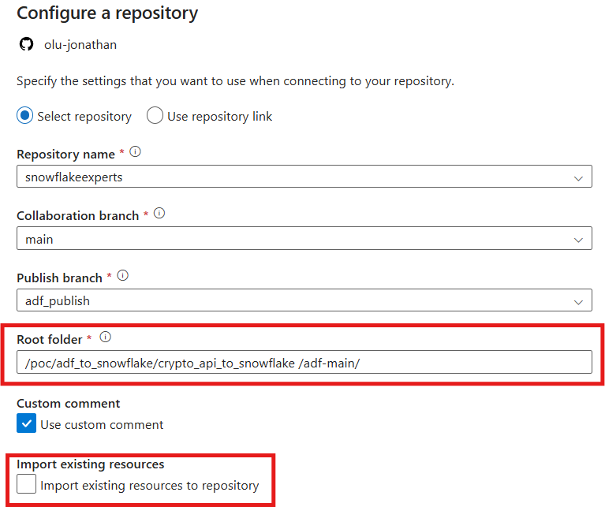
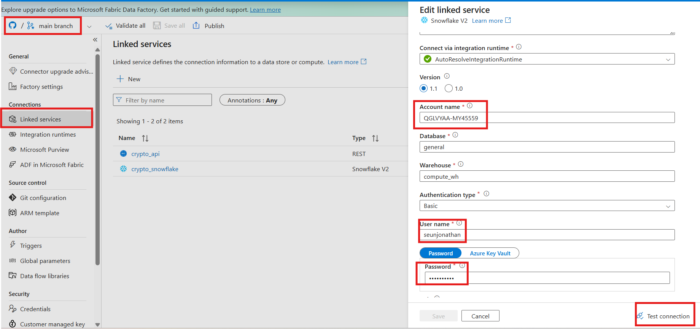

# ADF → Snowflake: Crypto Price Ingestion (Demo)

A minimal end-to-end example of ingesting data from a public REST API
(CoinGecko) into Snowflake using Azure Data Factory, on a 3-hour schedule.

## Architecture

```
CoinGecko API  --(Web Activity)-->  ADF Pipeline  --(Script Activity)-->  Snowflake BRONZE.CRYPTO_INGEST
                                          ^
                                   Schedule Trigger
                                   (every 30 min)
```

Raw API responses are landed as `VARCHAR` in a bronze table (audit-friendly,
resilient to shape changes), then flattened into typed columns via a
Snowflake view.

## Prerequisites

- Azure Data Factory instance
- Snowflake account + warehouse/database/schema you can write to
- ADF Snowflake linked service (key pair auth recommended for unattended
  scheduled runs — token/OAuth auth can expire and silently break the trigger)
- No API key needed for CoinGecko's public `/simple/price` endpoint
- Fork this repo into your github enironment

## Setup

### 1. Snowflake — create the landing table

Run [`sql/01_create_table.sql`](sql/01_create_table.sql).

### 2. Snowflake — create the flattened view

Run [`sql/02_flatten_view.sql`](sql/02_flatten_view.sql).


### 3. Azure Data Factory — Import Pipeline

You can import a complete pipeline that has been setup for you.







1. Create a new adf instance from azure portal.
2. Launch the adf studio and connect the code repository to link to your forked repo. In your setting, use path **/poc/adf_to_snowflake/crypto_api_to_snowflake
/adf-main/** Ensure you uncheck **Import existing resources to repository**
3. Once the repo is connect and the resources are imported, go to the red marked points in the image and edit your snowflake credentials.
4. Test the connection to ensure it works before you click APPLY.
5. You can open the pipeline and DEBUG once to ensure data lands in your snowflake table.
6. If you leave it running, it will pull data every 3 hours.

### 4. Pipeline explained.

Pipeline activities:
- **pull_from_api** (Web Activity) — GETs current BTC/ETH/SOL prices in USD
- **insert_to_snowflake** (Script Activity) — builds a clean JSON string
   from the response and inserts it as `VARCHAR` into `BRONZE.CRYPTO_INGEST`
- Tiggers **Every 30 minutes**.

### 6. Test

Run the pipeline manually first via **Trigger now** or **Debug**, then confirm data
landed:

```sql in snowflake
SELECT * FROM SILVER.CRYPTO_PRICES ORDER BY INGESTED_AT DESC;
```

## Why land as VARCHAR instead of VARIANT?

Landing the raw string first (rather than `PARSE_JSON()`-ing directly in
the pipeline) makes debugging easier — you can inspect exactly what ADF
sent if something breaks, and a malformed row won't fail the whole
pipeline run. Flattening happens downstream in Snowflake via
`TRY_PARSE_JSON()`, which returns `NULL` instead of erroring on bad data.

## Notes / gotchas

- Web Activity's `output` object includes ADF's own response headers and
  execution metadata alongside the actual API body. Don't stringify the
  whole `output` object into Snowflake — reference only the specific
  fields you need (see the Script Activity's dynamic content), or you'll
  hit JSON parsing errors on unescaped characters inside header values.
- The `activity('pull_from_api')` name in expressions must exactly match
  your Web Activity's name on the canvas.
- CoinGecko's public tier has a modest rate limit, but one call per
  3-hour run is well within it.
