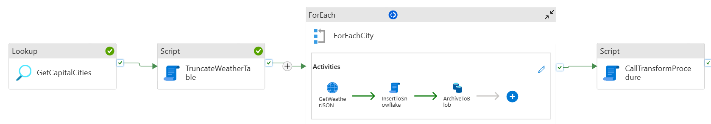
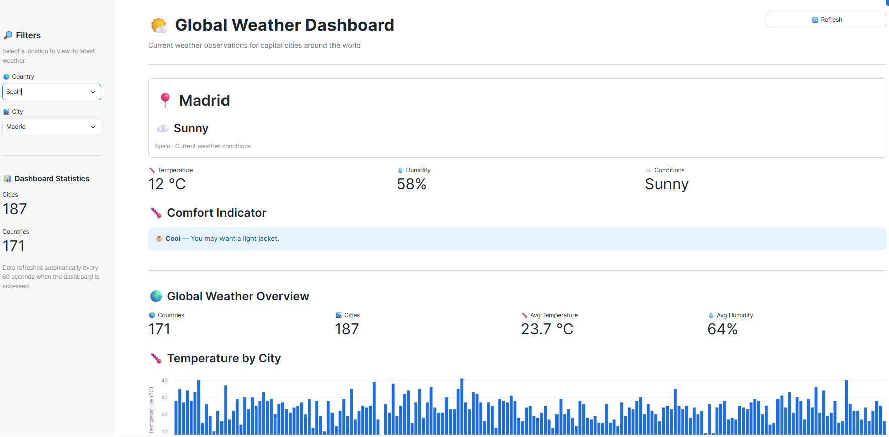

# 🌦️ API Weather Data Pipeline using Azure Data Factory & Snowflake

> **Demo Project:** Build an end-to-end modern data pipeline that
> collects weather data for capital cities around the world every 30
> minutes, processes semi-structured JSON in Snowflake, and presents the
> results through an interactive Streamlit dashboard.


------------------------------------------------------------------------

## 📌 Project Overview

This project demonstrates a practical **API → Azure Data Factory → Azure
Storage / Snowflake → Streamlit** data engineering architecture.

The pipeline retrieves weather information for every capital city stored
in a Snowflake reference table. Azure Data Factory orchestrates the
ingestion process, Snowflake handles semi-structured JSON
transformation, and a Streamlit application provides an interactive
dashboard for analysis.

### What this project demonstrates

-   REST API ingestion with Azure Data Factory
-   Dynamic API requests using ADF expressions
-   Lookup and `ForEach` orchestration patterns
-   Loading JSON into Snowflake `VARIANT` columns
-   Persisting raw API responses in Azure Data Lake / Blob Storage
-   Snowflake SQL and stored procedure processing
-   Flattening semi-structured JSON with `LATERAL FLATTEN`
-   Raw → Transformed → Presentation data layers
-   Parameterized and reusable ADF pipelines
-   Scheduled ingestion every 30 minutes
-   Streamlit deployment inside Snowflake
-   End-to-end cloud data engineering

------------------------------------------------------------------------

# 🏗️ Architecture

The solution consists of five primary components:

``` text
                    ┌──────────────────────┐
                    │     Weather API      │
                    │       wttr.in        │
                    │    JSON Response     │
                    └──────────┬───────────┘
                               │
                               │ REST
                               ▼
┌─────────────────────────────────────────────────────────────┐
│                    AZURE DATA FACTORY                       │
│                                                             │
│  1. Lookup capital cities                                   │
│           │                                                 │
│           ▼                                                 │
│  2. ForEach city                                             │
│           │                                                 │
│           ▼                                                 │
│  3. Web Activity → Weather API                              │
│           │                                                 │
│           ├───────────────┐                                 │
│           ▼               ▼                                 │
│  4. Snowflake RAW    5. Azure Storage                       │
│     weather_landing     raw-weather/{city}/                 │
│                          {timestamp}.json                    │
│           │                                                 │
│           ▼                                                 │
│  6. Stored Procedure                                         │
└───────────┬─────────────────────────────────────────────────┘
            │
            ▼
┌─────────────────────────────────────────────────────────────┐
│                       SNOWFLAKE                             │
│                                                             │
│  RAW                                                       │
│  └── weather_landing                                       │
│       └── VARIANT JSON                                     │
│                                                             │
│              │                                              │
│              ▼                                              │
│  TRANSFORMED                                               │
│  └── weather_transformed                                   │
│       ├── AREA_NAME                                        │
│       ├── HUMIDITY                                         │
│       ├── TEMP_C                                           │
│       ├── WEATHER_DESC                                     │
│       ├── OBS_TIME                                          │
│       ├── CITY_NAME                                         │
│       └── COUNTRY                                           │
│                                                             │
│              │                                              │
│              ▼                                              │
│  PRESENTATION                                              │
│  └── v_weather_current                                     │
└─────────────────────────┬───────────────────────────────────┘
                          │
                          ▼
              ┌─────────────────────────┐
              │ Streamlit in Snowflake  │
              │                         │
              │ • KPI cards             │
              │ • Global map             │
              │ • Weather table         │
              │ • Filters               │
              └─────────────────────────┘
```

------------------------------------------------------------------------

# 🔄 End-to-End Data Flow

The pipeline follows this sequence:

### 1. Read capital cities

ADF starts with a **Lookup activity** against the Snowflake reference
table:

``` sql
RAW.CAPITAL_CITIES
```

The table contains the cities that should be queried from the weather
API.

Example conceptual structure:

  CITY_NAME   COUNTRY          REGION
  ----------- ---------------- --------
  Abuja       Nigeria          Africa
  Accra       Ghana            Africa
  London      United Kingdom   Europe
  Tokyo       Japan            Asia

The Lookup output becomes the input to the `ForEach` activity.

------------------------------------------------------------------------

### 2. Iterate through each city

ADF uses a **ForEach activity** to process every city returned by the
Lookup.

Conceptually:

``` text
ForEach city
    │
    ├── Call weather API
    ├── Write JSON to Snowflake
    └── Write JSON to Azure Storage
```

This allows the same pipeline logic to be reused for every city rather
than creating a separate activity for each location.

------------------------------------------------------------------------

### 3. Call the Weather API

For each city, the ADF Web Activity dynamically constructs the API URL.

The demo uses:

``` text
https://wttr.in/{city}?format=j1
```

For example:

``` text
https://wttr.in/London?format=j1
```

The API returns weather information as JSON.

The JSON response contains nested structures such as:

-   Current conditions
-   Temperature
-   Humidity
-   Weather descriptions
-   Observation time
-   Nearest area
-   Request metadata
-   Weather forecasts

Because the response is semi-structured, the raw payload is preserved
before transformation.

------------------------------------------------------------------------

# 💾 Raw Data Strategy

The solution deliberately maintains the original API response.

This provides several benefits:

-   Preserves the source payload
-   Allows transformations to be changed later without re-calling the
    API
-   Supports troubleshooting
-   Provides an audit trail
-   Demonstrates semi-structured data processing
-   Separates ingestion from transformation

The raw payload is stored in two places:

### Snowflake RAW

``` text
RAW.WEATHER_LANDING
```

The primary JSON structures are stored in `VARIANT` columns.

Conceptually:

``` text
CURRENT_CONDITION   VARIANT
NEAREST_ARSA        VARIANT
REQUEST             VARIANT
WEATHER             VARIANT
```

> Column names may vary slightly depending on the final Snowflake DDL
> used by the implementation.

### Azure Storage

The API response is also persisted under a city-based folder structure:

``` text
raw-weather/
├── Abuja/
│   └── 2026-08-08 11:34:15.json
├── Accra/
│   └── 2026-08-08 11:34:15.json
├── London/
│   └── 2026-08-08 11:34:15.json
└── ...
```

This creates a simple historical landing area for the original API
responses.

------------------------------------------------------------------------

# ❄️ Snowflake Data Model

The Snowflake implementation uses a layered architecture.

``` text
RAW
 │
 │ JSON / VARIANT
 ▼
TRANSFORMED
 │
 │ Relationalized weather attributes
 ▼
PRESENTATION
 │
 │ Analytics-ready view
 ▼
STREAMLIT
```

## 1. RAW Layer

### `RAW.WEATHER_LANDING`

This layer stores the original semi-structured API response.

Example:

``` sql
CREATE TABLE RAW.WEATHER_LANDING (
    CURRENT_CONDITION VARIANT,
    NEAREST_ARSA      VARIANT,
    REQUEST           VARIANT,
    WEATHER           VARIANT
);
```

The exact definition should match the DDL used in your environment.

------------------------------------------------------------------------

# 2. TRANSFORMED Layer

### `TRANSFORMED.WEATHER_TRANSFORMED`

The stored procedure extracts the fields required by the dashboard.

Example conceptual structure:

``` text
AREA_NAME       VARCHAR
HUMIDITY        NUMBER
TEMP_C          NUMBER
WEATHER_DESC    VARCHAR
OBS_TIME        TIMESTAMP_TZ
CITY_NAME       VARCHAR
COUNTRY         VARCHAR
```

The purpose of this layer is to convert the nested JSON response into a
relational structure that is easier to query.

------------------------------------------------------------------------

# 3. PRESENTATION Layer

### `PRESENTATION.V_WEATHER_CURRENT`

The presentation view exposes the data needed by the Streamlit
application.

The presentation layer prevents the Streamlit application from having to
understand the underlying JSON structure.

------------------------------------------------------------------------

# 🧩 Snowflake Stored Procedure

A Snowflake Scripting stored procedure is used to transform the raw
JSON.

The procedure:

1.  Reads data from `RAW.WEATHER_LANDING`
2.  Extracts nested JSON objects
3.  Flattens semi-structured arrays
4.  Selects the required weather attributes
5.  Inserts relational data into `TRANSFORMED.WEATHER_TRANSFORMED`

Conceptually:

``` text
RAW.WEATHER_LANDING
        │
        │ VARIANT
        ▼
 JSON traversal
        │
        ▼
 LATERAL FLATTEN
        │
        ▼
 Field extraction
        │
        ▼
 TRANSFORMED.WEATHER_TRANSFORMED
```

This demonstrates one of Snowflake's major strengths: the ability to
process JSON directly without requiring a separate JSON processing
engine.

------------------------------------------------------------------------

# ⚙️ Azure Data Factory Pipeline



The ADF pipeline contains the following major activities.

  -----------------------------------------------------------------------
  \#                      Activity                Purpose
  ----------------------- ----------------------- -----------------------
  1                       Lookup                  Retrieve all capital
                                                  cities

  2                       ForEach                 Iterate through each
                                                  city

  3                       Web Activity            Call the weather API

  4                       Copy Activity #1        Load JSON into
                                                  Snowflake RAW

  5                       Copy Activity #2        Persist JSON to Azure
                                                  Storage

  6                       Stored Procedure        Transform RAW JSON into
                          Activity                relational data
  -----------------------------------------------------------------------

------------------------------------------------------------------------

## Activity 1 --- Lookup

The Lookup retrieves the list of cities.

Conceptual query:

``` sql
SELECT
    CAPITAL_CITY
FROM RAW.CAPITAL_CITIES;
```

ADF then passes the resulting array to the `ForEach` activity.

------------------------------------------------------------------------

## Activity 2 --- ForEach

The `ForEach` activity iterates over every city.

Conceptual expression:

``` text
@activity('Lookup Capital Cities').output.value
```

Within the loop, the current city can be referenced using:

``` text
@item().CAPITAL_CITY
```

------------------------------------------------------------------------

## Activity 3 --- Web Activity

The Web Activity calls:

``` text
https://wttr.in/{city}?format=j1
```

A dynamic ADF expression can construct the URL from the current city.

Conceptually:

``` text
https://wttr.in/@{item().CITY_NAME}?format=j1
```

URL encoding should be considered for city names containing spaces or
special characters.

------------------------------------------------------------------------

## Activity 4 --- Copy JSON to Snowflake

The API response is written into:

``` text
RAW.WEATHER_LANDING
```

The table uses `VARIANT` columns so the original JSON structure can be
retained.

The demo intentionally demonstrates a landing-table pattern where the
previous landing data is cleared before a new load.

> For a production implementation, consider retaining historical raw
> records instead of truncating the landing table, depending on the
> business and audit requirements.

------------------------------------------------------------------------

## Activity 5 --- Copy JSON to Azure Storage

The same API response is persisted in Azure Storage.

Recommended structure:

``` text
raw-weather/{city}/{timestamp}.json
```

For example:

``` text
raw-weather/London/2026-08-08-113415.json
```

This provides a durable copy of the source response.

------------------------------------------------------------------------

## Activity 6 --- Stored Procedure

After ingestion, ADF calls the Snowflake stored procedure.

Conceptually:

``` text
ADF
 │
 ▼
CALL <stored_procedure>()
 │
 ▼
RAW.WEATHER_LANDING
 │
 ▼
JSON transformation
 │
 ▼
TRANSFORMED.WEATHER_TRANSFORMED
```

------------------------------------------------------------------------

# ⏰ Pipeline Trigger

The pipeline is designed to execute **every 30 minutes**.

``` text
00:00
00:30
01:00
01:30
02:00
...
```

This provides a continuously refreshed weather dataset.

The trigger should be configured as an ADF **Schedule Trigger**.

------------------------------------------------------------------------

# ☁️ Azure Resources

The demo requires an Azure environment containing:

### Azure Data Factory

Used for:

-   Orchestration
-   API invocation
-   Looping
-   Data movement
-   Stored procedure execution
-   Scheduling

### Azure Storage Account

Used to persist raw JSON responses.

Example:

``` text
Storage Account
└── raw-weather
    ├── Abuja
    ├── Accra
    ├── London
    ├── Tokyo
    └── ...
```

### Snowflake

Used for:

-   Reference data
-   Raw JSON landing
-   JSON transformation
-   Analytics-ready presentation data
-   Streamlit application

------------------------------------------------------------------------

# ❄️ Snowflake Setup

Before running the ADF pipeline, create the required database objects.

A typical setup is:

``` text
ALONGE_DB
│
├── RAW
│   ├── CAPITAL_CITIES
│   └── WEATHER_LANDING
│
├── TRANSFORMED
│   └── WEATHER_TRANSFORMED
│
└── PRESENTATION
    └── WEATHER_REPORT
```

Example:

``` sql
CREATE DATABASE IF NOT EXISTS GENERAL;

CREATE SCHEMA IF NOT EXISTS GENERAL.RAW;
CREATE SCHEMA IF NOT EXISTS GENERAL.TRANSFORMED;
CREATE SCHEMA IF NOT EXISTS GENERAL.PRESENTATION;
```

Create/populate the capital-city reference table before executing the
pipeline.

------------------------------------------------------------------------

# 🔐 Connection Configuration

The ADF implementation requires connectivity to:

1.  Snowflake
2.  Azure Storage
3.  Weather API

------------------------------------------------------------------------

# 📁 Suggested Repository Structure

A recommended repository layout is:

``` text
.
├── README.md
│
├── adf/
│   ├── pipeline/
│   │   └── pl_weather_ingestion.json
│   ├── dataset/
│   │   ├── ds_capital_cities.json
│   │   ├── ds_weather_landing.json
│   │   └── ...
│   ├── linkedService/
│   │   ├── ls_snowflake.json
│   │   ├── ls_azure_storage.json
│   │   └── ...
│   ├── trigger/
│   │   └── trg_weather_30min.json
│   └── factory/
│       └── ...
│
├── sql/
│   ├── 01_database_schema.sql
│   ├── 02_capital_cities.sql
│   ├── 03_weather_landing.sql
│   ├── 04_weather_transformed.sql
│   ├── 05_transform_procedure.sql
│   └── 06_presentation_view.sql
│
├── streamlit/
│   ├── streamlit_app.py
│   └── requirements.txt
│
└── docs/
    └── architecture.png
```

------------------------------------------------------------------------

# 📊 Streamlit Dashboard

The final application is deployed in Snowflake using Streamlit.

The dashboard provides a simple global view of current weather
conditions.

## Key metrics

The dashboard can display:

-   Number of cities
-   Average temperature
-   Average humidity
-   Last refresh time

## Visualizations

### 🌍 Global map

Displays weather observations geographically by location.

### 📋 Weather table

Provides city-level details such as:

  City          Temperature °C   Humidity % Weather
  ----------- ---------------- ------------ ---------------
  Abuja                     26           72 Partly cloudy
  Accra                     27           78 Cloudy
  London                    16           65 Light rain
  New Delhi                 31           56 Haze
  Tokyo                     24           70 Overcast

Values above are illustrative examples.

### 🔎 Filters

Users can filter the dashboard by:

-   Region
-   Country
-   Weather condition

------------------------------------------------------------------------

# 🚀 Deployment Sequence

A recommended deployment order is:

``` text
1. Create Snowflake database and schemas
             ↓
2. Create CAPITAL_CITIES reference table
             ↓
3. Create WEATHER_LANDING table
             ↓
4. Create WEATHER_TRANSFORMED table
             ↓
5. Create transformation stored procedure
             ↓
6. Create PRESENTATION view
             ↓
7. Create Azure Storage account/container
             ↓
8. Create/configure ADF
             ↓
9. Configure Snowflake linked service
             ↓
10. Configure Storage linked service
             ↓
11. Configure ADF datasets
             ↓
12. Deploy weather pipeline
             ↓
13. Test one pipeline execution
             ↓
14. Validate Snowflake data
             ↓
15. Configure 30-minute trigger
             ↓
16. Deploy Streamlit application
             ↓
17. Validate dashboard
```

------------------------------------------------------------------------

# 🧪 Testing the Pipeline

Before enabling the 30-minute trigger, run the pipeline manually.

## Test 1 --- Validate Lookup

Confirm that the Lookup returns the expected number of capital cities.

------------------------------------------------------------------------

## Test 2 --- Validate API Response

Check the Web Activity output.

The response should be valid JSON.

------------------------------------------------------------------------

## Test 3 --- Validate Snowflake RAW

Query:

``` sql
SELECT *
FROM RAW.WEATHER_LANDING;
```

Confirm that the JSON payload has been loaded successfully.

------------------------------------------------------------------------

## Test 4 --- Validate Transformation

Query:

``` sql
SELECT *
FROM TRANSFORMED.WEATHER_TRANSFORMED
ORDER BY INSERTED_AT DESC;
```

Confirm that temperature, humidity, city, country and weather
description have been extracted.

------------------------------------------------------------------------

## Test 5 --- Validate Presentation View

``` sql
SELECT *
FROM PRESENTATION.WEATHER_REPORT;
```

------------------------------------------------------------------------

## Test 6 --- Validate Azure Storage

Confirm that JSON files are being created under:

``` text
raw-weather/{city}/{timestamp}.json
```

------------------------------------------------------------------------

## Test 7 --- Validate Streamlit

Confirm that the dashboard displays the newly ingested weather data.


------------------------------------------------------------------------

# 🎓 Learning Objectives

After completing this project, a learner should understand how to:

### Azure Data Factory

-   Create pipelines
-   Use Lookup activities
-   Use ForEach loops
-   Call REST APIs
-   Use dynamic expressions
-   Configure Copy Activities
-   Execute Snowflake stored procedures
-   Schedule pipelines

### Snowflake

-   Store JSON in `VARIANT`
-   Query semi-structured data
-   Flatten nested JSON
-   Build stored procedures
-   Implement RAW / TRANSFORMED / PRESENTATION layers
-   Build analytics-ready views
-   Deploy Streamlit applications

### Cloud Data Engineering

-   Build API ingestion pipelines
-   Separate raw and transformed data
-   Persist source data
-   Implement orchestration
-   Design for scalability
-   Apply security and governance principles

------------------------------------------------------------------------

# 🧠 Key Design Principles

This project demonstrates several important data engineering principles:

> **Ingest first. Transform later.**

Preserve the source payload before applying transformations.

> **Separate orchestration from transformation.**

ADF orchestrates the workflow while Snowflake performs the data
transformation.

> **Use layered data architecture.**

``` text
RAW → TRANSFORMED → PRESENTATION
```

> **Make ingestion reusable.**

The same ADF logic processes every city through a dynamic `ForEach`.

> **Keep the presentation layer simple.**

The Streamlit application consumes an analytics-ready view rather than
parsing raw JSON.


------------------------------------------------------------------------

# 🏁 Final Dashboard


------------------------------------------------------------------------
